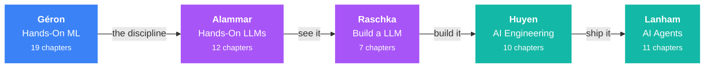

<div align="center">

# AI Engineering Roadmap

**A 30-week, book-driven path from `sklearn.fit()` to shipping and operating LLM systems.**

Five books · 59 chapters · one library you build yourself · six projects that prove it.

[](https://github.com/MfmRifath/ai-engineering-roadmap/actions/workflows/ci.yml)
[](https://www.python.org/)
[](LICENSE)
[](LICENSE-CONTENT)

[**Roadmap**](ROADMAP.md) · [**Concept Matrix**](CURRICULUM.md) · [**Progress**](PROGRESS.md) · [**Books**](books/MANIFEST.md) · [**Projects**](projects/)

</div>

---

## Why this exists

Most "AI roadmap" repos are link dumps. You read them, feel productive, and learn nothing.

This one is built around five books that happen to cover the whole stack with almost no gaps —
and, crucially, that **overlap**. Nearly every important idea appears in three or four of them
from different angles: Alammar draws it, Raschka makes you build it, Huyen tells you what breaks
at scale, Géron gives you the statistical footing to know when you are fooling yourself.



The repo turns that overlap into a method:

1. **[ROADMAP.md](ROADMAP.md)** — eight phases that interleave the books in learning order
   rather than reading them end to end.
2. **[CURRICULUM.md](CURRICULUM.md)** — a concept × book matrix. Pick a topic, spiral through
   every book that covers it, intuition → implementation → production.
3. **[`src/aieng/`](src/aieng/)** — one Python package that grows as you go. By the end you have
   written your own tokenizer, attention, GPT, RAG pipeline, eval harness, and agent loop.
4. **[`projects/`](projects/)** — six builds that force you to prove it.

---

## The books

| # | Book | Author | Chapters | Role |
|---|---|---|---|---|
| 1 | Hands-On Machine Learning (2e) | Géron | 19 | Foundations — the discipline |
| 2 | Hands-On Large Language Models | Alammar & Grootendorst | 12 | Intuition — see it |
| 3 | Build a LLM (From Scratch) | Raschka | 7 | Demystification — build it |
| 4 | AI Engineering | Huyen | 10 | Profession — ship it |
| 5 | AI Agents in Action | Lanham | 11 | Frontier — extend it |

> **The books are not in this repository and never will be.** They are copyrighted; buy them.
> [books/MANIFEST.md](books/MANIFEST.md) has ISBNs and publisher links. Put your own copies in
> `library/` (gitignored) and `make toc` will verify them against the notes.

---

## Progress

<!-- PROGRESS:START -->
**Overall: 0 / 59 chapters (0%)**

`░░░░░░░░░░░░░░░░░░░░░░░░░░░░` 0%

| Phase | Progress | Done | Status |
|---|---|---|---|
| Phase 1 — ML Foundations | `░░░░░░░░░░░░░░░░` | 0/9 | not started |
| Phase 2 — Deep Learning Foundations | `░░░░░░░░░░░░░░░░` | 0/7 | not started |
| Phase 3 — Sequences, Attention & Generative Precursors | `░░░░░░░░░░░░░░░░` | 0/3 | not started |
| Phase 4 — LLM Intuition | `░░░░░░░░░░░░░░░░` | 0/9 | not started |
| Phase 5 — Transformers From Scratch | `░░░░░░░░░░░░░░░░` | 0/7 | not started |
| Phase 6 — Fine-Tuning & Representation | `░░░░░░░░░░░░░░░░` | 0/5 | not started |
| Phase 7 — Production AI Engineering | `░░░░░░░░░░░░░░░░` | 0/8 | not started |
| Phase 8 — Agents | `░░░░░░░░░░░░░░░░` | 0/11 | not started |
<!-- PROGRESS:END -->

<sub>Auto-generated from the checkboxes in [ROADMAP.md](ROADMAP.md) by
`scripts/build_progress.py`. Tick a box, run `make progress`.</sub>

---

## Getting started

```bash
git clone https://github.com/MfmRifath/ai-engineering-roadmap.git
cd ai-engineering-roadmap

python -m venv .venv
source .venv/bin/activate          # Windows: .venv\Scripts\activate

make setup                         # package + dev tools, no torch — fast
# make setup-all                   # everything, including torch (slow)

make test                          # confirm the from-scratch code works
```

Then put your book PDFs in `library/` and:

```bash
make toc                           # verify your editions match the notes
```

**Your first week:** read [ROADMAP.md](ROADMAP.md), open
[Géron ch. 1](books/01-hands-on-ml-geron/notes/ch01.md), and start ticking boxes.

Already experienced? [Skip ahead](ROADMAP.md#if-you-are-coming-from-a-different-angle) — but do
not skip Raschka.

---

## What you build

| Project | Phase | You end up with |
|---|---|---|
| [p1 — End-to-end ML service](projects/p1-end-to-end-ml-service/) | 1 | A trained model behind a FastAPI endpoint, containerized |
| [p2 — RAG over my library](projects/p2-rag-over-my-library/) | 4 | Semantic search over your own PDF shelf, with citations |
| [p3 — nanoGPT from scratch](projects/p3-nanogpt-from-scratch/) | 5 | A GPT you wrote and pretrained, no `transformers` modeling code |
| [p4 — LLM eval harness](projects/p4-llm-eval-harness/) | 7 | A CLI that scores prompts and models and reports regressions |
| [p5 — Agent platform](projects/p5-agent-platform/) | 8 | A tool-using agent with memory that recovers from failures |
| [p6 — Production LLM app](projects/p6-production-llm-app/) | 8 | The capstone: RAG + agent + evals + guardrails + monitoring |

p2 is deliberate — the books you cannot commit become the corpus you retrieve over.

---

## Repo layout

```
├── ROADMAP.md            8 phases, 59 chapter checkboxes
├── CURRICULUM.md         concept × book matrix + study spirals
├── PROGRESS.md           generated from ROADMAP checkboxes
├── books/                one directory per book
│   ├── MANIFEST.md       what to buy and where
│   ├── _toc/             chapter maps extracted from the real PDFs
│   └── NN-slug/notes/    chapter notes — the bulk of the writing
├── src/aieng/            the library you build across the roadmap
├── tests/                real assertions against the from-scratch code
├── projects/             six capstones
├── notebooks/            one runnable notebook per phase
├── cheatsheets/          one-page references
├── flashcards/           Anki-importable deck, generated from notes
├── resources/            papers, courses, glossary
├── scripts/              toc extraction, progress, flashcards, scaffolding
└── library/              your PDFs — gitignored, never committed
```

---

## The workflow

Reading without producing anything is how you forget a book in a month. Each chapter:

```bash
make note BOOK=03-build-llm-from-scratch-raschka CH=3   # scaffold from template
# read the chapter, fill the note in, write the code in src/aieng/
make test                                                # your code must pass
make cards                                               # regenerate the deck
# tick the box in ROADMAP.md
make progress
git commit -am "R3: coding attention mechanisms"
```

Every note follows the same shape — **why it matters**, **core concepts**, **key code**,
**gotchas**, **exercises**, **flashcards**, **cross-links** — which is what makes the flashcard
deck and progress tracking mechanical instead of a chore.

Flashcards are written inline as `<!-- card -->` blocks and harvested into
[`flashcards/`](flashcards/) as a tab-separated Anki import. Spaced repetition is the difference
between having read something and knowing it.

---

## Commands

| Command | Does |
|---|---|
| `make setup` | Install the package + dev tools (fast) |
| `make test` | Run the test suite |
| `make lint` / `make fmt` | Check / auto-fix formatting |
| `make toc` | Re-extract chapter maps from `library/*.pdf` |
| `make progress` | Rebuild PROGRESS.md and the bar above |
| `make cards` | Rebuild the Anki deck from note flashcards |
| `make note BOOK=… CH=…` | Scaffold a chapter note |
| `make check` | Everything CI runs |

---

## Contributing

This is primarily a personal learning log, but corrections and better explanations are welcome —
see [CONTRIBUTING.md](CONTRIBUTING.md). One rule above all others: **never commit book content.**
CI enforces it, but do not make CI do the thinking.

## License

Code is [MIT](LICENSE). Notes are [CC BY-NC-SA 4.0](LICENSE-CONTENT). The books belong to their
authors and publishers — [buy them](books/MANIFEST.md).

<div align="center">
<sub>Built while learning. If it helped, star it and go build something.</sub>
</div>
