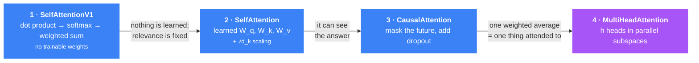

# R3 — Coding Attention Mechanisms

> **Thesis:** Attention is a weighted average where the model learns the weights — and you can
> build it in four steps, each of which fixes exactly one limitation of the last.

## Why this chapter matters

**The most important chapter in the roadmap.** Everything before it is preparation; everything
after it is application. Around 200 lines of code, and when you have written them, the transformer
stops being a diagram and becomes a thing you understand.

The four-version progression is the pedagogy. Do not skip to version 4 — the reason each version
exists is the explanation.

## Core concepts

The four versions, and the single limitation each one removes:



**Do not skip to version 4.** The reason each version exists *is* the explanation.

### Version 1 — Simplified self-attention, no trainable weights

Start with the mechanism stripped of learning. For each input token, compute how relevant every
other token is to it, then take a weighted average.

```python
# For a single query at position i:
attn_scores = inputs @ inputs[i]              # dot product = raw relevance
attn_weights = torch.softmax(attn_scores, dim=-1)   # normalize to sum to 1
context_vec = attn_weights @ inputs           # weighted average of all inputs
```

Three moves, and they are the whole idea:

1. **Dot product as similarity.** Vectors pointing the same way score high.
2. **Softmax to normalize.** Weights become non-negative and sum to 1 — a proper weighted average,
   and differentiable.
3. **Weighted sum.** Each output is a blend of all inputs, weighted by relevance.

**The limitation:** nothing is learned. Relevance is fixed by whatever the input vectors happen
to be. The model has no way to decide that, for *this* task, verbs should attend to their subjects.

### Version 2 — Trainable weights (Q, K, V)

Introduce three learned projections:

$$q_i = x_i W_q, \qquad k_i = x_i W_k, \qquad v_i = x_i W_v$$

$$\text{Attention}(Q,K,V) = \text{softmax}\!\left(\frac{QK^\top}{\sqrt{d_k}}\right)V$$

Why three separate matrices — the thing to actually understand:

- **Query** — what this position is looking for
- **Key** — what this position advertises about itself
- **Value** — what this position contributes when selected

Separating key from value is the crucial design choice. **What makes a token *findable* is not
the same as what it *contributes*.** With a single matrix you would be forced to conflate them.

**The √d_k scaling.** Dot products of *d*-dimensional random vectors have variance proportional
to *d*. Large scores push softmax toward a one-hot distribution where gradients vanish
([G16](../../01-hands-on-ml-geron/notes/ch16.md)). Dividing by √d_k keeps variance ~1. Raschka
demonstrates this empirically — run his experiment, it makes the abstraction concrete.

**Use `nn.Linear`, not `nn.Parameter(torch.rand(...))`.** Raschka shows both. `nn.Linear` with
`bias=False` is mathematically equivalent but has a much better initialization scheme, and it
trains noticeably better.

### Version 3 — Causal attention

A language model predicting token *i+1* must not see token *i+1*. Mask the future.



**Implementation matters here.** The naive approach — compute softmax, then zero the upper
triangle — is wrong, because the remaining weights no longer sum to 1. You would have to
renormalize.

The correct approach masks the **scores** with −∞ *before* the softmax:

```python
mask = torch.triu(torch.ones(T, T), diagonal=1).bool()
attn_scores.masked_fill_(mask, -torch.inf)
attn_weights = torch.softmax(attn_scores / d_k**0.5, dim=-1)   # already sums to 1
```

`exp(-inf) = 0`, so masked positions get exactly zero weight and the softmax normalizes over
only the visible ones. One line, correct by construction. Raschka shows both approaches
deliberately — seeing the wrong one is what makes the right one memorable.

**Dropout on attention weights** ([G11](../../01-hands-on-ml-geron/notes/ch11.md)) prevents
over-reliance on specific positions. Applied after softmax, and PyTorch scales the surviving
weights by 1/(1−p) to preserve the expected sum.

Register the mask as a **buffer** (`self.register_buffer`), not a parameter — it moves with the
model across devices and is saved in the state dict, but receives no gradient.

### Version 4 — Multi-head attention

One attention operation produces exactly one weighted average, so it can only attend to one
thing. Multiple heads attend in different learned subspaces simultaneously.

**The naive version** stacks *h* independent `CausalAttention` modules and concatenates. Correct,
and slow — *h* separate small matrix multiplications.

**The efficient version** does one big projection and reshapes:

```python
# One projection for all heads, then split
keys = self.W_key(x)                                    # (B, T, d_out)
keys = keys.view(B, T, self.num_heads, self.head_dim)   # split the last dim
keys = keys.transpose(1, 2)                             # (B, num_heads, T, head_dim)
```

Same mathematics, one large GEMM instead of *h* small ones — dramatically better GPU utilization.
The `.view()` then `.transpose()` dance is the part everyone gets wrong the first time. Print
shapes at every step.

**`d_head = d_out / n_heads`.** The dimensions are split among heads, not duplicated. GPT-2 small:
768 / 12 = 64 per head. Total attention parameters are the same as single-head — you get
specialization for free.

The final `out_proj` linear layer after concatenation is not decorative; it mixes information
across heads and is present in the original architecture.

## Key code

The complete implementation — this is the chapter:

```python
import torch
import torch.nn as nn

class MultiHeadAttention(nn.Module):
    def __init__(self, d_in, d_out, context_length, dropout, num_heads, qkv_bias=False):
        super().__init__()
        assert d_out % num_heads == 0, "d_out must be divisible by num_heads"
        self.d_out = d_out
        self.num_heads = num_heads
        self.head_dim = d_out // num_heads          # split, not duplicate

        self.W_query = nn.Linear(d_in, d_out, bias=qkv_bias)
        self.W_key   = nn.Linear(d_in, d_out, bias=qkv_bias)
        self.W_value = nn.Linear(d_in, d_out, bias=qkv_bias)
        self.out_proj = nn.Linear(d_out, d_out)     # mixes information across heads
        self.dropout = nn.Dropout(dropout)

        # buffer, not parameter: moves with the model, gets no gradient
        self.register_buffer(
            "mask",
            torch.triu(torch.ones(context_length, context_length), diagonal=1).bool(),
        )

    def forward(self, x):
        b, num_tokens, _ = x.shape

        # One projection each, then split into heads
        queries = self.W_query(x).view(b, num_tokens, self.num_heads, self.head_dim)
        keys    = self.W_key(x).view(b, num_tokens, self.num_heads, self.head_dim)
        values  = self.W_value(x).view(b, num_tokens, self.num_heads, self.head_dim)

        queries, keys, values = (t.transpose(1, 2) for t in (queries, keys, values))

        attn_scores = queries @ keys.transpose(2, 3)          # (b, heads, T, T)
        attn_scores.masked_fill_(self.mask[:num_tokens, :num_tokens], -torch.inf)

        attn_weights = torch.softmax(attn_scores / keys.shape[-1] ** 0.5, dim=-1)
        attn_weights = self.dropout(attn_weights)

        context = (attn_weights @ values).transpose(1, 2)     # (b, T, heads, head_dim)
        context = context.contiguous().view(b, num_tokens, self.d_out)
        return self.out_proj(context)
```

Your version lives in
[`src/aieng/transformer/attention.py`](../../../src/aieng/transformer/attention.py), and
[`tests/test_attention.py`](../../../tests/test_attention.py) checks it against PyTorch's
built-in to 1e-5.

## Gotchas

- **Masking after the softmax.** The weights no longer sum to 1. Mask the scores with −∞ *before*.
- **`self.mask` as a parameter instead of a buffer.** It would get gradients and be optimized —
  nonsense.
- **Not slicing the mask to `num_tokens`.** The buffer is `context_length` square; a shorter
  sequence needs `mask[:T, :T]`. Otherwise you get a shape error, or worse, silent broadcasting.
- **`.view()` without `.contiguous()` after `.transpose()`.** Transpose produces a non-contiguous
  tensor; `.view()` will raise. Use `.contiguous().view()` or `.reshape()`.
- **Dividing by `d_out` instead of `head_dim`.** The scaling uses the *per-head* dimension.
- **Forgetting `out_proj`.** Easy to omit and it costs quality.
- **`nn.Parameter(torch.rand(...))` instead of `nn.Linear`.** Poor initialization; trains worse.
- **Not zeroing dropout at eval time.** `model.eval()` — otherwise generation is randomly
  degraded.

## Exercises

**Understand**
1. Why are there three separate projection matrices rather than one?
2. Why separate keys from values — what would break if you merged them?
3. Why must masking happen before the softmax?
4. Why is `d_head = d_out / n_heads` rather than `d_head = d_out`?

**Build**
1. **Build all four versions in order.** No shortcuts. This is the chapter.
2. Verify: your `MultiHeadAttention` output must match `torch.nn.MultiheadAttention` (with
   matching weights and `is_causal=True`) to within 1e-5. `pytest tests/test_attention.py`.
3. Exercise 3.1 — confirm `SelfAttention_v1` and `SelfAttention_v2` produce identical output when
   you transfer the weights correctly. The transpose is the lesson.
4. Exercise 3.2 — configure a 2-head attention with `d_out=2`, so `head_dim=1`. Work out what
   must change.
5. Exercise 3.3 — initialize `MultiHeadAttention` with GPT-2 small's config (768 dims, 12 heads,
   1024 context) and count the parameters.
6. Remove the √d_k scaling and train briefly. Watch the attention weights saturate.
7. Print the attention weight matrix for a real sentence and confirm the upper triangle is exactly
   zero.

## Flashcards

<!-- card -->
Q: What are the three steps of simplified (untrainable) self-attention?
A: (1) Dot product between vectors as a relevance score; (2) softmax to normalize scores into weights summing to 1; (3) weighted sum of the input vectors. Attention is a weighted average — the trainable version just learns the weights.
<!-- /card -->

<!-- card -->
Q: Why does attention use three separate projections rather than one?
A: Query is what a position seeks, key is what it advertises, value is what it contributes if selected. Separating key from value is essential: what makes a token *findable* is not the same as what it *contributes*.
<!-- /card -->

<!-- card -->
Q: Why must causal masking be applied before the softmax, not after?
A: Zeroing weights after softmax leaves them un-normalized — they no longer sum to 1. Setting the *scores* to −∞ before softmax gives exp(−inf) = 0 and the softmax normalizes over only the visible positions, correct by construction.
<!-- /card -->

<!-- card -->
Q: Why register the causal mask as a buffer rather than a parameter?
A: Buffers move with the model across devices and are saved in the state dict, but receive no gradients and are not optimized. A mask is fixed structure, not something to learn.
<!-- /card -->

<!-- card -->
Q: How does efficient multi-head attention avoid h separate matrix multiplications?
A: One large projection produces all heads at once; `.view()` splits the last dimension into (num_heads, head_dim) and `.transpose()` moves the head dimension forward. Same math, one big GEMM instead of h small ones — far better GPU utilization.
<!-- /card -->

<!-- card -->
Q: What is `d_head` for GPT-2 small, and why does multi-head attention cost no extra parameters?
A: 768 / 12 = 64. The output dimension is *split* among heads rather than duplicated, so total parameters match single-head attention — head specialization comes for free.
<!-- /card -->

<!-- card -->
Q: Why `nn.Linear(bias=False)` instead of `nn.Parameter(torch.rand(...))` for the projections?
A: Mathematically equivalent, but `nn.Linear` uses a proper initialization scheme (scaled to fan-in) rather than uniform [0,1), and consequently trains noticeably better.
<!-- /card -->

<!-- card -->
Q: Why does `.view()` fail after `.transpose()`?
A: Transpose returns a non-contiguous view — the memory layout no longer matches the logical shape. Use `.contiguous().view()` or `.reshape()`.
<!-- /card -->

## Cross-links

| Book | Where | Angle |
|---|---|---|
| Géron | [G16](../../01-hands-on-ml-geron/notes/ch16.md) | Where attention came from, and √d_k |
| Alammar | [A3](../../02-hands-on-llms-alammar/notes/ch03.md) | The visual intuition for this code |
| Raschka | [R4](ch04.md) | Wrapping this in a transformer block |
| Huyen | [H9](../../04-ai-engineering-huyen/notes/ch09.md) | Making it fast: KV cache, GQA, FlashAttention |

[Concept matrix](../../../CURRICULUM.md) · [Prev: ch02](ch02.md) · [Next: ch04](ch04.md)
