# H6 — RAG and Agents

> **Thesis:** RAG and agents are both answers to the same question — how do you give a model
> context it does not have? — and they differ only in whether the model gets to choose what to
> fetch.

## Why this chapter matters

Huyen's framing unifies two things usually taught separately, and the unification is genuinely
clarifying. RAG retrieves from a fixed store; an agent decides what to retrieve, from where, and
what to do with it. **An agent with one retrieval tool is a RAG system with agency.**

This is also the production counterpart to
[A8](../../02-hands-on-llms-alammar/notes/ch08.md) — largely a catalogue of how the naive version
breaks.

## Core concepts

## Part 1 — RAG

### Retrieval quality is the ceiling

**The single most important fact:** the generator cannot answer from context it never received.
If retrieval fails, no amount of prompt engineering, no better model, and no reranking downstream
will save you. **Retrieval quality is the ceiling on system quality.**

Which is why [H4](ch04.md) insists you measure retrieval separately. It has ground truth, it is
cheap to evaluate, and it is where most failures live.

### Retrieval algorithms

**Term-based (BM25)** — fast, interpretable, exact matching, no training. Strong on names, codes,
identifiers, and rare terms. Still a serious baseline in 2026, and frequently beats poorly-tuned
dense retrieval.

**Embedding-based** — semantic, handles paraphrase, needs a good domain-matched model.

**Hybrid** — both, fused. **Reciprocal Rank Fusion** is the standard: score by
$\sum_i 1/(k + \text{rank}_i)$, which needs no score normalization across retrievers and works
robustly. Use it.

**Vector indexes.** Exact search to ~100k vectors; beyond that, HNSW or IVF trade recall for
speed. The knobs are explicit recall/latency tradeoffs — measure recall against exact search
rather than trusting defaults.

### Retrieval optimization

The techniques that separate demo RAG from working RAG:

- **Chunking strategy** — size, overlap, and respecting document structure
  ([A8](../../02-hands-on-llms-alammar/notes/ch08.md)). The highest-leverage hyperparameter, and
  it interacts with your document type.
- **Contextual retrieval** — prepend a short document-level summary to each chunk before
  embedding, so an isolated chunk carries the context it needs to be findable. Large,
  cheap-to-implement gains.
- **Query rewriting** — expand, decompose, or clarify the query before retrieving. Handles
  under-specified queries and follow-ups that depend on conversation history ("what about the
  other one?" is unretrievable as written).
- **Reranking** — the cross-encoder two-stage pattern. Highest-leverage single addition.
- **Metadata filtering** — date, source, permissions. Cheap, exact, and often what the user
  actually meant.
- **MMR** — diversity in results, so you do not retrieve five near-identical chunks
  ([A5](../../02-hands-on-llms-alammar/notes/ch05.md)).

### RAG beyond text

Tabular data — retrieve the schema, generate SQL, execute. **This converts retrieval into
functional correctness**, which you can evaluate exactly ([H3](ch03.md)). A good example of
restructuring a task so it becomes measurable.

Multimodal — retrieve images alongside text via a shared embedding space
([A9](../../02-hands-on-llms-alammar/notes/ch09.md)).

## Part 2 — Agents

### The definition

An agent perceives an environment and acts on it. In practice: **an LLM in a loop with tools.**

The components:
- **Tools** — what it can do
- **Planning** — deciding what to do
- **Memory** — what it knows across steps
- **The loop** — think, act, observe, repeat

### Tools

Three categories, and the risk rises sharply down the list:

| Type | Examples | Risk |
|---|---|---|
| **Knowledge** | Search, retrieval, database read | Low |
| **Capability** | Calculator, code execution, image generation | Medium |
| **Write** | Send email, place order, modify records | **High** |

Write tools are where agents become dangerous, and where
[H5](ch05.md)'s injection analysis becomes load-bearing. Every write tool is an action an attacker
would like to trigger.

**Tool design matters as much as prompt design.** Clear names, typed parameters, and descriptions
written for the model rather than for a human reader. Too many tools degrades selection — Huyen
notes accuracy falls as the tool count rises, which argues for scoping tools per context rather
than exposing everything.

### Planning

**Decoupling planning from execution** is the key design move: generate a plan, *validate it*,
then execute. This catches invalid plans before they cost anything, and lets a human review
consequential ones.

Planning approaches: chain-of-thought, ReAct (interleaved reasoning and action), plan-then-execute,
and reflection (critique the result, retry).

**Function calling** is now the standard interface, with typed schemas rather than parsed text.

### Failure modes — the part to internalize

Huyen's decomposition of *where* agents fail is the most useful content in the chapter:

| Failure | Description |
|---|---|
| **Planning failure** | Invalid plan, wrong tool, wrong parameters, impossible goal |
| **Tool failure** | The tool errors, times out, or returns something unexpected |
| **Efficiency failure** | Correct answer, absurd cost — 20 calls where 2 would do |

That third row is the one people miss. **An agent that gets the right answer through 20 tool
calls has failed**, and end-to-end accuracy will not tell you.



**Compounding error** is the structural constraint: 95% per step over 10 steps is ~60% end to end.
This is why production "agents" are usually constrained workflows with one or two decision points
rather than open-ended loops. That constraint is a feature.

**Evaluating agents** therefore requires evaluating the **trajectory**, not just the output: was
the tool choice right? Were the parameters valid? How many steps? What did it cost? Did it recover
from the failed call? ([L10](../../05-ai-agents-in-action-lanham/notes/ch10.md))

### Memory

Three kinds:
- **Internal knowledge** — what is in the weights
- **Short-term** — the context window
- **Long-term** — external storage, retrieved as needed

**Long-term agent memory is RAG with a write path.** Once you see that, the design questions are
familiar ones: what to write, when to write it, how to retrieve it, and how to handle staleness
and contradiction. [L8](../../05-ai-agents-in-action-lanham/notes/ch08.md) goes further.

## Key code

```python
# Hybrid retrieval with Reciprocal Rank Fusion — no score normalization needed
def reciprocal_rank_fusion(rankings: list[list[str]], k: int = 60) -> list[str]:
    scores: dict[str, float] = {}
    for ranking in rankings:
        for rank, doc_id in enumerate(ranking):
            scores[doc_id] = scores.get(doc_id, 0.0) + 1.0 / (k + rank + 1)
    return sorted(scores, key=scores.get, reverse=True)

results = reciprocal_rank_fusion([bm25_search(q, 50), dense_search(q, 50)])
```

```python
# Contextual retrieval: give each chunk enough context to be findable alone
def contextualize(chunk: str, doc_summary: str) -> str:
    return f"[Document context: {doc_summary}]\n\n{chunk}"
```

```python
# An agent loop with the guards that keep it from being a runaway
def run_agent(task, tools, max_steps=10, max_cost=0.50):
    messages, cost = [{"role": "user", "content": task}], 0.0
    for step in range(max_steps):                      # ALWAYS cap iterations
        resp = model(messages, tools=tools)
        cost += resp.cost
        if cost > max_cost:                            # AND cost
            return {"status": "budget_exceeded", "step": step}
        if not resp.tool_calls:
            return {"status": "done", "answer": resp.content, "steps": step, "cost": cost}
        for call in resp.tool_calls:
            try:
                result = dispatch(call)                # least privilege lives here
            except Exception as e:
                result = f"Tool error: {e}. Try a different approach."  # recover, don't crash
            messages.append({"role": "tool", "content": str(result)})
    return {"status": "max_steps_exceeded"}
```

Yours: [`src/aieng/rag/`](../../../src/aieng/rag/) and
[`src/aieng/agents/`](../../../src/aieng/agents/).

## Gotchas

- **Optimizing generation when retrieval is the problem.** Measure retrieval first, always.
- **Dense retrieval only.** Fails on identifiers and rare terms. Hybrid.
- **No reranker.** The cheapest large win.
- **Stuffing every retrieved chunk in.** Distraction plus lost-in-the-middle ([H5](ch05.md)).
- **Ignoring metadata filters.** Often exactly what the user meant, and free.
- **No iteration cap on an agent loop.** Runaway cost is the classic agent incident.
- **No cost budget.** Cap it, per request.
- **Tool errors crashing the loop.** Feed the error back and let the agent recover — that is the
  behaviour worth building.
- **Too many tools.** Selection accuracy degrades. Scope per context.
- **Evaluating only the final output.** You will not see efficiency failures at all.
- **Write tools without confirmation.** Combined with injection, this is the real risk.

## Exercises

**Understand**
1. Why is retrieval quality the ceiling on RAG quality?
2. How does RRF avoid the score-normalization problem?
3. Name the three agent failure modes and say which is hardest to detect.
4. Why is 95% per-step reliability insufficient for a 10-step agent?
5. In what sense is long-term agent memory just RAG?

**Build**
1. Add hybrid retrieval with RRF to your [p2](../../../projects/p2-rag-over-my-library/) pipeline
   and measure recall@5 against dense-only.
2. Implement contextual retrieval — prepend a document summary to each chunk before embedding —
   and measure the gain. It is usually large.
3. Build the agent loop above with iteration and cost caps. Then deliberately break a tool and
   confirm the agent recovers rather than crashing.
4. Instrument the loop to log the full trajectory. Evaluate 20 runs on tool choice, step count,
   and cost — not just the answer. Find an efficiency failure.
5. Measure the effect of tool count: run the same tasks with 3, 10, and 25 tools available and
   record selection accuracy.

## Flashcards

<!-- card -->
Q: Why is retrieval quality the ceiling on RAG system quality?
A: The generator can only work with the context it receives. If the right passage was never retrieved, no prompt engineering, better model, or reranking can recover it. This is why retrieval must be measured separately — it has ground truth and is where most failures live.
<!-- /card -->

<!-- card -->
Q: What is Reciprocal Rank Fusion and why is it the standard hybrid method?
A: Score each document as Σ 1/(k + rank_i) across retrievers. It uses only ranks, so it needs no score normalization between BM25 and dense scores — which is exactly the problem that makes naive score-blending fragile.
<!-- /card -->

<!-- card -->
Q: What is contextual retrieval?
A: Prepending a short document-level summary to each chunk before embedding, so an isolated chunk carries enough context to be findable on its own. Cheap to implement and usually a large recall gain.
<!-- /card -->

<!-- card -->
Q: Name the three agent failure modes.
A: Planning failure (invalid plan, wrong tool, wrong parameters), tool failure (errors, timeouts, unexpected output), and **efficiency failure** — the right answer reached through absurdly many calls. The third is invisible to end-to-end accuracy metrics.
<!-- /card -->

<!-- card -->
Q: Why does compounding error constrain agent design?
A: Per-step success multiplies: 95% over 10 steps is ~60% end to end. This is why most production "agents" are constrained workflows with one or two LLM decision points rather than open-ended loops — the constraint is a feature.
<!-- /card -->

<!-- card -->
Q: How does Huyen unify RAG and agents?
A: Both answer "how do I give the model context it lacks?" RAG retrieves from a fixed store; an agent decides what to fetch, from where, and what to do with it. An agent with a single retrieval tool *is* a RAG system with agency.
<!-- /card -->

<!-- card -->
Q: What are the three tool categories and which is dangerous?
A: Knowledge tools (search, read) — low risk. Capability tools (calculator, code execution) — medium. **Write tools** (send email, place order, modify records) — high, because combined with prompt injection they turn the agent into a confused deputy.
<!-- /card -->

<!-- card -->
Q: Why should a tool error be fed back to the agent rather than raised?
A: Recovery is the behaviour you want. Returning "Tool error: X. Try a different approach." lets the agent adapt; crashing the loop wastes the run and hides the failure mode you should be measuring.
<!-- /card -->

## Cross-links

| Book | Where | Angle |
|---|---|---|
| Alammar | [A8](../../02-hands-on-llms-alammar/notes/ch08.md) | The naive RAG this critiques |
| Alammar | [A7](../../02-hands-on-llms-alammar/notes/ch07.md) | First look at agents |
| Huyen | [H4](ch04.md) | Component-level evaluation |
| Huyen | [H5](ch05.md) | Injection risk through retrieved content |
| Lanham | [L5](../../05-ai-agents-in-action-lanham/notes/ch05.md) | Tools, in depth |
| Lanham | [L8](../../05-ai-agents-in-action-lanham/notes/ch08.md) | Memory as a design problem |
| Lanham | [L10](../../05-ai-agents-in-action-lanham/notes/ch10.md) | Trajectory evaluation |

[Concept matrix](../../../CURRICULUM.md) · [Prev: ch05](ch05.md) · [Next: ch07](ch07.md)
