# H9 — Inference Optimization

> **Thesis:** LLM decoding is memory-bandwidth-bound, not compute-bound — and once you internalize
> that, every optimization in the field becomes predictable rather than magical.

## Why this chapter matters

Inference is where the money goes. Unlike classical ML, where training dominated the bill
([G19](../../01-hands-on-ml-geron/notes/ch19.md)), foundation models cost per request forever. A
2× inference improvement is a 50% cost reduction in perpetuity.

The bandwidth insight is also the single most explanatory fact in the book: it predicts why
batching helps so much, why quantization speeds things up, and why decode is far slower than FLOP
counts suggest.

## Core concepts

### The metrics, and what drives each

| Metric | Meaning | Bound by |
|---|---|---|
| **TTFT** | Time to first token | Prefill — **compute**-bound |
| **TPOT** | Time per output token | Decode — **memory-bandwidth**-bound |
| **Total latency** | TTFT + TPOT × output_tokens | Both |
| **Throughput** | Requests or tokens per second | Batching, hardware |
| **Goodput** | Requests/sec **meeting your SLO** | Everything |

**Goodput** is Huyen's most useful contribution here. High throughput with terrible tail latency
is not a good system; goodput counts only requests that actually met their latency target, which
is what users experience.

**The fundamental tension:** larger batches raise throughput and *worsen* per-request latency.
No setting optimizes both, so you must decide which you are serving.

### The bandwidth insight

Prefill and decode are genuinely different workloads.

**Prefill** processes all prompt tokens in parallel — large matrix multiplications over many
tokens, high arithmetic intensity, **compute-bound**.

**Decode** generates one token at a time. To produce a single token you must read **the entire
model's weights** from memory. For a 14 GB model at 2 TB/s of memory bandwidth that is a hard
floor of ~7 ms per token, *regardless of how fast the arithmetic units are*.



This one fact explains nearly everything:

- **Why batching helps so disproportionately.** Weights are read once and amortized across every
  sequence in the batch. Batch 32 does ~32× the useful work for roughly the same memory traffic.
- **Why quantization speeds up decode.** Half the bytes means half the memory traffic. int8 is
  roughly 2× faster on decode largely independent of any arithmetic saving.
- **Why bigger models are disproportionately slower at decode.** More weights to stream, every
  single token.
- **Why speculative decoding works at all.** A small draft model proposes several tokens; the
  large model verifies them in *one* forward pass. Multiple tokens for one weight read.

### Model-level optimization

**Quantization** — the highest-leverage single change
([G19](../../01-hands-on-ml-geron/notes/ch19.md), [H7](ch07.md)). int8 nearly free, int4 a small
cost. Weight-only quantization is the common case for decode, since weights *are* the traffic.

**Distillation** — a small model trained on a large one's outputs ([H8](ch08.md)). The best
latency win available if you can afford the training.

**Attention optimizations:**

| Technique | Saves |
|---|---|
| **FlashAttention** | Memory traffic — tiled, never materializes the n×n matrix |
| **PagedAttention** | KV cache fragmentation, à la OS virtual memory |
| **MQA / GQA** | KV cache size — fewer key/value heads |
| **Sliding window** | Quadratic → linear attention cost |

**PagedAttention** (vLLM) deserves attention: naive KV cache allocation reserves the maximum
sequence length per request and wastes most of it. Paging in fixed blocks — exactly like OS
virtual memory — massively improves memory utilization and therefore achievable batch size.

**Speculative decoding** — a small draft model generates *k* tokens, the large model verifies them
in one pass, accepted tokens are kept. Output is **mathematically identical** to the large
model's; speedup depends on the acceptance rate. A rare free lunch.

### Service-level optimization

**Batching strategies:**

| Strategy | How | Problem |
|---|---|---|
| **Static** | Wait for N requests, process together | Early arrivals wait; whole batch waits for the longest |
| **Dynamic** | Batch within a time window | Better, still head-of-line blocking |
| **Continuous** | Add/remove sequences per decoding **step** | **The standard.** Finished sequences leave immediately |

**Continuous batching** is the big one. Because generation lengths vary wildly, static batching
wastes enormous capacity waiting on the longest sequence. Continuous batching evicts finished
sequences and admits new ones at every step — typically a several-fold throughput improvement. It
is the reason vLLM, TGI, and TensorRT-LLM exist.

**Prefill/decode disaggregation** — run the two phases on separate hardware pools, since one is
compute-bound and the other bandwidth-bound. Increasingly common at large scale.

**Prompt/prefix caching** — reuse the KV cache for a shared prompt prefix
([A3](../../02-hands-on-llms-alammar/notes/ch03.md)). Enormous savings for long system prompts and
few-shot examples, and it is exactly why **stable content goes first** in your prompt
([H5](ch05.md)).

**Response caching** — for repeated queries, exact or semantic.

**Parallelism** — tensor (split a layer's matrices), pipeline (split by layers), and data. Needed
once a model exceeds one device.

### Hardware

The numbers that matter for an accelerator, in this order for most LLM serving: **memory
capacity** (does the model fit?), **memory bandwidth** (decode speed), **compute** (prefill
speed). Headline FLOPs mislead, because decode does not use them.

## Key code

```python
def decode_floor_ms(n_params_b: float, bytes_per_param: float,
                    bandwidth_tb_s: float) -> float:
    """Lower bound on ms per output token: all weights must stream per token."""
    bytes_read = n_params_b * 1e9 * bytes_per_param
    return bytes_read / (bandwidth_tb_s * 1e12) * 1000

# A100-class, ~2 TB/s
print(decode_floor_ms(7,  2,   2.0))   # fp16 7B  -> ~7.0 ms/token  (~143 tok/s)
print(decode_floor_ms(7,  0.5, 2.0))   # int4 7B  -> ~1.75 ms/token (~571 tok/s)
print(decode_floor_ms(70, 2,   2.0))   # fp16 70B -> ~70 ms/token   (~14 tok/s)
```

Compare those floors against what you actually observe. If you are far above the floor, the
problem is your serving stack, not your hardware.

```python
def kv_cache_gb(n_layers, n_kv_heads, head_dim, seq_len, batch, bytes_per=2):
    """KV cache memory — usually what actually limits concurrency."""
    return 2 * n_layers * n_kv_heads * head_dim * seq_len * batch * bytes_per / 1e9

# Llama-3-8B (32 layers, 8 KV heads with GQA, head_dim 128) at 8k context:
print(kv_cache_gb(32, 8, 128, 8192, batch=1))    # ~1.07 GB per sequence
print(kv_cache_gb(32, 8, 128, 8192, batch=32))   # ~34 GB — more than the model itself
```



That second number is the point: **at scale the KV cache, not the weights, is your constraint.**

## Gotchas

- **Optimizing FLOPs.** Decode is bandwidth-bound; arithmetic optimizations barely move it.
- **Reporting throughput without latency.** Report goodput — throughput within your SLO.
- **Static batching in production.** The whole batch waits on the longest generation.
- **Forgetting KV cache memory.** It frequently exceeds the model and sets max concurrency.
- **Variable prompt content first.** Defeats prefix caching ([H5](ch05.md)).
- **Quantizing without measuring quality.** Speed is not free below int8.
- **Benchmarking with uniform prompt lengths.** Real traffic has a long tail, and the tail is what
  breaks batching.
- **Assuming speculative decoding always helps.** Gains depend on draft acceptance rate; a poorly
  matched draft model can be net negative.
- **Buying hardware on FLOPs.** Check memory capacity and bandwidth first.

## Exercises

**Understand**
1. Why is decode memory-bandwidth-bound while prefill is compute-bound?
2. Explain why batching improves throughput so disproportionately.
3. Why is continuous batching better than dynamic batching?
4. Why does speculative decoding not change the output distribution?

**Build**
1. Implement the decode-floor calculator. Compare its prediction against measured tokens/sec for a
   local model. **Explain the gap** — that explanation is the exercise.
2. Compute KV cache memory for your model at 4k, 32k, and 128k context, batch 1 and 32. Find where
   it exceeds the weights.
3. Benchmark throughput and p50/p95 latency across batch sizes 1, 4, 16, 64. Plot the tension.
4. Measure prefix caching: the same long system prompt over 100 requests, with and without.
5. Compare fp16 / int8 / int4 on tokens/sec **and** quality. Build the table.

## Flashcards

<!-- card -->
Q: Why is LLM decode memory-bandwidth-bound?
A: Generating one token requires reading the entire model's weights from memory. For a 14 GB model at 2 TB/s that is a ~7 ms floor per token regardless of arithmetic speed. Prefill processes many tokens in parallel and is compute-bound instead.
<!-- /card -->

<!-- card -->
Q: Why does batching improve LLM throughput so disproportionately?
A: Weights are read from memory once and amortized across every sequence in the batch. Batch 32 does roughly 32× the useful work for approximately the same memory traffic — and memory traffic is the actual bottleneck.
<!-- /card -->

<!-- card -->
Q: What is continuous batching and why does it beat static batching?
A: Sequences are added to and removed from the batch at every decoding step, so finished ones leave immediately and new ones join. Static batching makes the whole batch wait for the longest generation, and generation lengths vary enormously.
<!-- /card -->

<!-- card -->
Q: What is PagedAttention?
A: KV cache memory management in fixed-size blocks, like OS virtual memory paging. It removes the fragmentation caused by reserving max-sequence-length per request, substantially raising achievable batch size.
<!-- /card -->

<!-- card -->
Q: Why does speculative decoding produce identical output to the large model?
A: A small draft model proposes k tokens and the large model verifies them in a single forward pass, accepting only tokens it would have produced anyway. The output distribution is mathematically unchanged — you just got several tokens for one weight read.
<!-- /card -->

<!-- card -->
Q: What is goodput and why prefer it to throughput?
A: Requests per second that actually meet your latency SLO. Raw throughput can look excellent while tail latency makes the service unusable; goodput counts only what users would accept.
<!-- /card -->

<!-- card -->
Q: When does the KV cache exceed the model weights?
A: At long context with moderate batch size. Llama-3-8B with GQA at 8k context uses ~1 GB per sequence — at batch 32 that is ~34 GB, more than the model itself. At scale the KV cache, not the weights, limits concurrency.
<!-- /card -->

<!-- card -->
Q: What should you check first when choosing an accelerator for LLM serving?
A: Memory capacity (does the model fit?), then memory bandwidth (decode speed), then compute (prefill speed). Headline FLOPs mislead because decode does not use them.
<!-- /card -->

## Cross-links

| Book | Where | Angle |
|---|---|---|
| Géron | [G19](../../01-hands-on-ml-geron/notes/ch19.md) | Serving, batching, quantization — classical form |
| Alammar | [A3](../../02-hands-on-llms-alammar/notes/ch03.md) | KV cache and efficient attention |
| Huyen | [H7](ch07.md) | Quantization for training |
| Huyen | [H4](ch04.md) | Latency and cost as evaluation criteria |
| Huyen | [H10](ch10.md) | Caching and routing in the architecture |

[Concept matrix](../../../CURRICULUM.md) · [Prev: ch08](ch08.md) · [Next: ch10](ch10.md)
