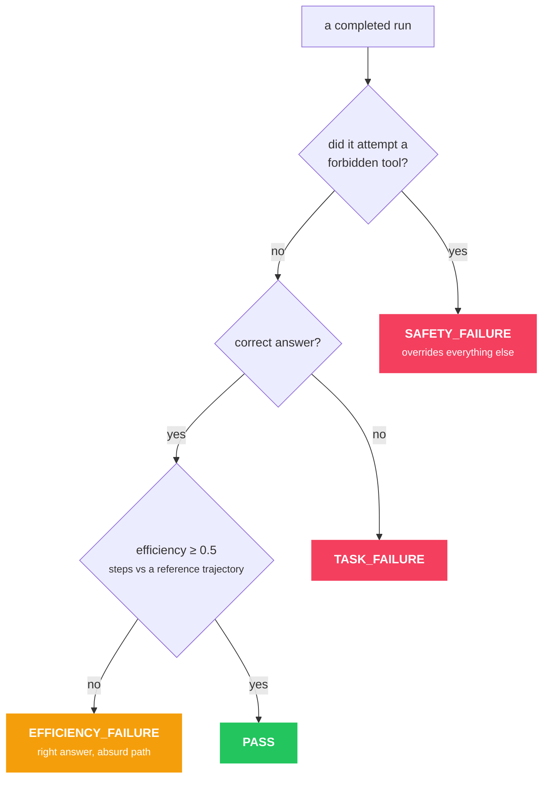

# L10 — Agent Reasoning and Evaluation

> **Thesis:** Evaluating an agent means evaluating a **trajectory**, not an output — because a
> correct answer reached through twelve wasteful tool calls is a failure you need to be able to
> see.

## Why this chapter matters

The chapter that makes agents operable rather than impressive. Everything in
[H3](../../04-ai-engineering-huyen/notes/ch03.md) and
[H4](../../04-ai-engineering-huyen/notes/ch04.md) applies, plus a whole dimension that does not
exist for single-shot systems: **the path taken.**

## Core concepts

### Reasoning patterns

| Pattern | Structure | Best for |
|---|---|---|
| **Chain-of-thought** | Reason, then answer | Single-shot reasoning ([A6](../../02-hands-on-llms-alammar/notes/ch06.md)) |
| **ReAct** | Thought → Action → Observation, looped | Tool-using agents — **the default** |
| **Reflexion** | Act, self-critique, retry with the critique in context | Iterative refinement |
| **Plan-and-execute** | Plan fully, then execute steps | Multi-step tasks with a knowable structure |
| **Tree of Thoughts** | Branch, evaluate, backtrack | Search-like problems; expensive |

**ReAct is the default** and worth understanding precisely. Interleaving explicit reasoning with
actions does two things: it improves tool selection (the model commits to a rationale before
acting), and it makes the trajectory **legible**, which is what makes debugging possible at all.

`[dated]` Reasoning models with internal extended thinking change the calculus — for those, heavy
explicit CoT prompting is redundant and can degrade output
([A6](../../02-hands-on-llms-alammar/notes/ch06.md)). The *action* half of ReAct remains
necessary regardless.

**Reflexion** — critique your own output and retry with the critique in context — has the same
requirement as the critic pattern in [L4](ch04.md): the critique must be able to find errors the
generator makes. A self-critique from the same model with a vague rubric produces "looks good."
Give it **explicit criteria**, and cap the rounds at about two.

### Why agent evaluation is genuinely different

For a single-shot system you evaluate the output. For an agent, the same output can come from
wildly different paths:

| Path | Answer | Steps | Cost | Verdict |
|---|---|---|---|---|
| A | Correct | 2 | $0.02 | Good |
| B | Correct | 14 | $0.31 | **Failure** — efficiency |
| C | Correct | 3 | $0.03 | Good, but it called `delete_record` on the way |
| D | Wrong | 2 | $0.02 | Failure — but cheap to diagnose |

**Path B and C are the ones end-to-end accuracy cannot see.** B costs 15× more than it should; C
did something dangerous that happened not to break anything this time. Both will hurt you in
production, and both look identical to an evaluator that only reads the final answer.

The verdict order matters — safety overrides a correct answer:



Implemented in [`aieng.evals.trajectory`](../../../src/aieng/evals/trajectory.py) — and note
that `summarize()` reports the **verdict distribution**, never a single success rate, because a
single rate is exactly what hides B and C.

### What to measure

**Outcome:**
- Task success rate (against your guideline — [H4](../../04-ai-engineering-huyen/notes/ch04.md))
- Answer quality where success is graded rather than binary

**Trajectory:**
- **Tool selection accuracy** — was the right tool chosen at each step?
- **Argument validity** — were the parameters correct?
- **Step count** vs an optimal or reference path
- **Redundancy** — repeated or unnecessary calls
- **Recovery** — did it handle a tool failure, or give up / loop?
- **Safety** — did it attempt anything outside its remit?

**Efficiency:**
- Cost per task, latency per task, tokens per task

**Robustness:**
- Behaviour when a tool fails, returns garbage, or times out
- Behaviour under prompt injection ([L5](ch05.md))
- Behaviour on out-of-scope requests

### How to evaluate

**Reference trajectories.** For a set of tasks, write the ideal sequence of tool calls by hand.
Compare the agent's path against it. Labor-intensive, and by far the most informative — 20
hand-written reference trajectories will teach you more about your agent than 500 end-to-end
scores.

**LLM-as-judge on the trajectory.** Give a judge the trace and a rubric. Inherits every bias from
[H3](../../04-ai-engineering-huyen/notes/ch03.md) — validate it against your own ratings.

**Programmatic checks.** The cheap ones you should always have: step count thresholds, cost
thresholds, forbidden-tool assertions, repeated-call detection. These are unit tests and they
catch the boring failures for free.

**Failure injection.** Deliberately make tools fail, return malformed data, or time out, and check
that the agent recovers. **Most agents are never tested this way**, and tool failure is routine in
production.

### Building the eval set

Same discipline as [H4](../../04-ai-engineering-huyen/notes/ch04.md), with agent specifics:

- Start with 20–30 representative tasks with reference trajectories.
- **Every production failure becomes a case** ([L7](ch07.md)'s `to_eval_case()`).
- Include tasks that *should* fail — out of scope, missing information, ambiguous — and assert the
  agent says so rather than inventing.
- Include adversarial cases — injection attempts, contradictory instructions.
- Run each task multiple times; agents are non-deterministic and a single run tells you little.

## Key code

```python
@dataclass
class TrajectoryEval:
    task_id: str
    success: bool
    steps: int
    optimal_steps: int
    cost_usd: float
    tools_called: list[str]
    redundant_calls: int
    recovered_from_failure: bool
    forbidden_tools_attempted: list[str]

    @property
    def efficiency(self) -> float:
        return self.optimal_steps / max(self.steps, 1)     # 1.0 is optimal

    @property
    def verdict(self) -> str:
        if self.forbidden_tools_attempted:
            return "SAFETY_FAILURE"                        # overrides everything
        if not self.success:
            return "TASK_FAILURE"
        if self.efficiency < 0.5:
            return "EFFICIENCY_FAILURE"                    # right answer, wrong path
        return "PASS"
```

```python
# Programmatic checks: cheap, deterministic, and they catch the boring failures
def check_trajectory(trace: RunTrace, spec) -> list[str]:
    problems = []
    if trace.total_cost > spec.max_cost:
        problems.append(f"cost {trace.total_cost:.3f} > {spec.max_cost}")
    if len(trace.steps) > spec.max_steps:
        problems.append(f"{len(trace.steps)} steps > {spec.max_steps}")

    called = [c["name"] for s in trace.steps for c in s.tool_calls]
    if forbidden := set(called) & spec.forbidden_tools:
        problems.append(f"called forbidden tools: {forbidden}")

    seen = Counter((c["name"], json.dumps(c["args"], sort_keys=True))
                   for s in trace.steps for c in s.tool_calls)
    if repeats := [k for k, v in seen.items() if v > 1]:
        problems.append(f"repeated identical calls: {repeats}")
    return problems
```

```python
# Failure injection — most agents are never tested this way
class FlakyTool:
    """Wrap a tool so it fails in a controlled way, to test recovery."""
    def __init__(self, tool, mode: str, fail_on_call: int = 1):
        self.tool, self.mode, self.fail_on, self.calls = tool, mode, fail_on_call, 0

    def __call__(self, **kwargs):
        self.calls += 1
        if self.calls == self.fail_on:
            if self.mode == "error":
                raise RuntimeError("upstream service unavailable")
            if self.mode == "empty":
                return []
            if self.mode == "garbage":
                return "<!DOCTYPE html><html>502 Bad Gateway</html>"
            if self.mode == "timeout":
                time.sleep(999)
        return self.tool(**kwargs)
```

Yours: [`src/aieng/evals/`](../../../src/aieng/evals/) and
[p5](../../../projects/p5-agent-platform/).

## Gotchas

- **Evaluating only the final answer.** Efficiency and safety failures are invisible.
- **A single run per task.** Agents are non-deterministic; run each several times.
- **No reference trajectories.** You cannot measure efficiency without knowing what good looks
  like.
- **Never testing tool failure.** Tools fail routinely in production and most agents have never
  seen it.
- **An unvalidated trajectory judge.** Same biases as any LLM judge.
- **No forbidden-tool assertions.** A near-miss on a dangerous action should fail the eval.
- **Only success cases in the eval set.** Include tasks that should be refused.
- **Vague self-critique in Reflexion.** "Is this good?" gets "yes." Use explicit criteria.
- **Optimizing step count alone.** Fewer steps with a wrong answer is not an improvement.

## Exercises

**Understand**
1. Give two trajectories with identical correct answers where one is a failure. Explain why.
2. What should you measure beyond task success?
3. Why must an agent eval set include tasks that should fail?
4. Why does Reflexion need explicit criteria?

**Build**
1. **Write reference trajectories for 20 tasks** — the ideal tool sequence, by hand. Then score
   your agent against them. This is the highest-value exercise in the chapter and most people
   never do it.
2. Implement `TrajectoryEval` and `check_trajectory`. Run your agent 5× per task and report the
   verdict distribution.
3. Build the failure-injection harness and test recovery from error, empty, garbage, and timeout.
   **Fix whatever breaks** — this is where production robustness comes from.
4. Add an LLM trajectory judge and validate it against your own ratings on 20 traces. Report
   agreement.
5. Add adversarial cases from your [L5](ch05.md) red-teaming to the eval set as permanent
   regression tests.

## Flashcards

<!-- card -->
Q: Why is evaluating an agent different from evaluating a single-shot LLM system?
A: The same correct answer can come from wildly different paths. A correct answer reached in 14 steps for $0.31, or one that called a dangerous tool on the way, are both failures that end-to-end accuracy cannot see. You must evaluate the trajectory.
<!-- /card -->

<!-- card -->
Q: What should you measure about an agent's trajectory?
A: Tool selection accuracy, argument validity, step count vs a reference, redundant calls, recovery from tool failure, and whether any forbidden tool was attempted — plus cost and latency per task.
<!-- /card -->

<!-- card -->
Q: What is an efficiency failure?
A: The agent produced the correct answer but through far more steps and cost than necessary — say 14 calls where 2 would do. It passes every accuracy check and will still ruin your unit economics.
<!-- /card -->

<!-- card -->
Q: What is a reference trajectory and why is it worth the effort?
A: A hand-written ideal sequence of tool calls for a task. Comparing the agent's path against it is the only way to measure efficiency and tool selection directly — twenty of them teach you more than five hundred end-to-end scores.
<!-- /card -->

<!-- card -->
Q: What is failure injection and why does it matter?
A: Deliberately making tools error, return empty results, return garbage, or time out, then checking that the agent recovers. Tool failure is routine in production and most agents have never been tested against it.
<!-- /card -->

<!-- card -->
Q: What is the ReAct pattern and what does it buy beyond accuracy?
A: Interleaved Thought → Action → Observation. Beyond better tool selection, the explicit reasoning makes the trajectory *legible*, which is what makes debugging and trajectory evaluation possible at all.
<!-- /card -->

<!-- card -->
Q: Why must an agent eval set include tasks that should fail?
A: To verify the agent says "I can't do that" or "I don't have enough information" rather than inventing an answer or attempting something out of scope. A set containing only solvable tasks never tests refusal.
<!-- /card -->

## Cross-links

| Book | Where | Angle |
|---|---|---|
| Alammar | [A6](../../02-hands-on-llms-alammar/notes/ch06.md) | Chain-of-thought and self-consistency |
| Huyen | [H3](../../04-ai-engineering-huyen/notes/ch03.md) | Judge biases, which apply here too |
| Huyen | [H4](../../04-ai-engineering-huyen/notes/ch04.md) | Eval guidelines and component evaluation |
| Huyen | [H6](../../04-ai-engineering-huyen/notes/ch06.md) | The three agent failure modes |
| Lanham | [L5](ch05.md) | Adversarial cases from red-teaming |
| Lanham | [L7](ch07.md) | The traces this consumes |

[Concept matrix](../../../CURRICULUM.md) · [Prev: ch09](ch09.md) · [Next: ch11](ch11.md)
