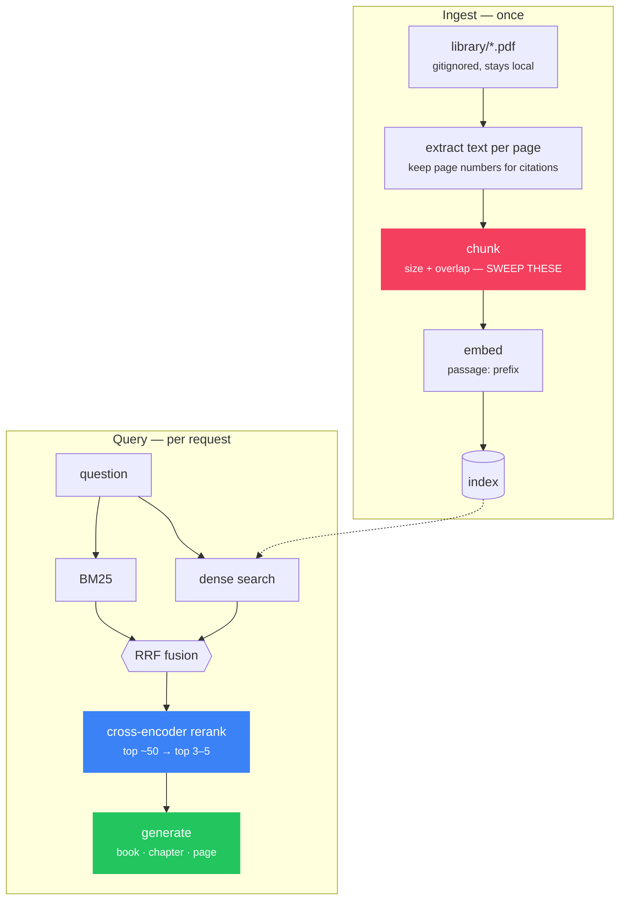

# p2 — RAG over my library

**After Phase 4 · Draws on [A8](../../books/02-hands-on-llms-alammar/notes/ch08.md),
[H6](../../books/04-ai-engineering-huyen/notes/ch06.md)**

Build a retrieval system over the five PDFs in your gitignored `library/`, then
measure it properly. The books you cannot commit become the corpus you retrieve
over — which also means you can ask questions across all five at once, something
no single book's index can do.

## Why this project

RAG is the most common LLM architecture in production and the one most often
built badly. The difference between a demo and a working system is entirely in
the measurement, and this project is structured to force that:

> **You are not done when it answers a question. You are done when you can state
> its recall@5 and defend the number.**

## Spec



The two red/blue nodes are where the quality is: **chunking**, the hyperparameter almost
nobody sweeps, and **reranking**, the cheapest large win and the one most often skipped.

## Definition of done

- [ ] Ingests all five PDFs and reports chunk counts per book
- [ ] **Hybrid retrieval** — BM25 + dense, fused with
      [`reciprocal_rank_fusion`](../../src/aieng/rag/fusion.py). Dense-only fails
      on exact strings like "GPT-2 small" or "50257"; prove that to yourself.
- [ ] **A cross-encoder reranker** over the top ~50 candidates
- [ ] Answers cite **book, chapter, and page**, and the citations are correct
- [ ] Refuses to answer when retrieval returns nothing relevant
- [ ] **A 20-question evaluation set** you wrote by hand, with the passage that
      answers each one
- [ ] **recall@5 reported**, computed with
      [`aieng.evals.metrics`](../../src/aieng/evals/metrics.py)
- [ ] A chunking sweep: size × overlap grid, recall@5 for each, and a chosen
      configuration you can justify

## The experiment that teaches the most

Sweep chunk size over `[128, 256, 512, 1024]` and overlap over `[0, 10%, 20%]`,
and plot recall@5. Twelve configurations, one afternoon.

Most people never do this and carry a default chunk size for years. You will
find the curve has a clear peak, that it moves depending on the book, and that
the difference between the best and worst configuration is larger than the
difference between embedding models.

## Pitfalls

- **No query/passage prefix.** Many retrieval models are asymmetric and expect
  `"query: "` / `"passage: "`. Omitting them degrades results *silently*.
- **Chunking on character counts alone.** A chunk that starts mid-sentence embeds
  badly. Split on structure, then fall back to size.
- **Skipping the reranker.** It is the cheapest large win available.
- **Stuffing 20 chunks into the prompt.** Distraction plus lost-in-the-middle.
  Fewer, better chunks win.
- **Evaluating only the final answer.** Retrieval has ground truth — measure it
  separately or you will never know which half is broken.
- **Re-embedding with a different model than you indexed with.** Silent garbage.

## Stretch

- **Contextual retrieval** ([H6](../../books/04-ai-engineering-huyen/notes/ch06.md)):
  prepend a chapter-level summary to each chunk before embedding. Measure the gain.
- Generate synthetic questions from passages to expand the eval set for free — you
  already know which passage each came from
  ([H8](../../books/04-ai-engineering-huyen/notes/ch08.md)).
- Query rewriting for follow-up questions ("what about the other one?").
- Metadata filters — restrict to one book, or to chapters you have finished.
- Serve it as a CLI you actually use while studying. That is the real test.

## Getting started

```bash
pip install -e ".[rag]"
python -m projects.p2_rag_over_my_library.ingest --library library/
python -m projects.p2_rag_over_my_library.ask "why is decode memory-bandwidth-bound?"
```

## Legal note

The extracted text stays local, exactly like the PDFs — `.gitignore` covers
`data/` and `*.parquet`. **Do not commit extracted book text**; it is the book,
in a different container. CI will not catch that, so it is on you.
